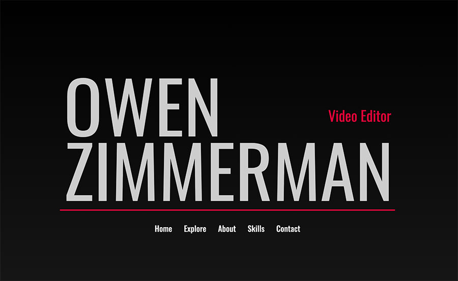

# Animated-Portfolio
Animated portfolio for Video Editor

## General Info

[Owen Zimmerman, Video Editor](https://jennifer0101.github.io/Animated-Portfolio/) is a portfolio website that utilizes animation reminscent of a title in a feature film, and unique horizontal scrolling. This app is intended to show off the skills and abilities of the featured video editor in a creative way.  

## Technologies

* JQuery
* Javascript
* CSS3
* HTML5
* Materialize 1.0.0
* GSAP Greensock Animation

## Credits

This website took inspiration from the GSAP Text Heading Animation by Suraj Radhakrishnan found here:[CopePen Heading Animation](https://codepen.io/surajr1711/pen/oNbmRxw), Anchor navigation to ScrollTriggered section by GreenSock found here: [CodePen Anchor Navigation Tutorial](https://codepen.io/GreenSock/pen/rNKzZdj), and GSAP Bounce Annimation by Caleb Gittins  found here: [CodePen Anchor Navigation Tutorial](https://codepen.io/calebgittins/pen/WzjMPa).

## Project Status

The project is still in progress.

## Contact
Created by [@jennifer0101](https://www.fayecreative.com) - feel free to contact me!